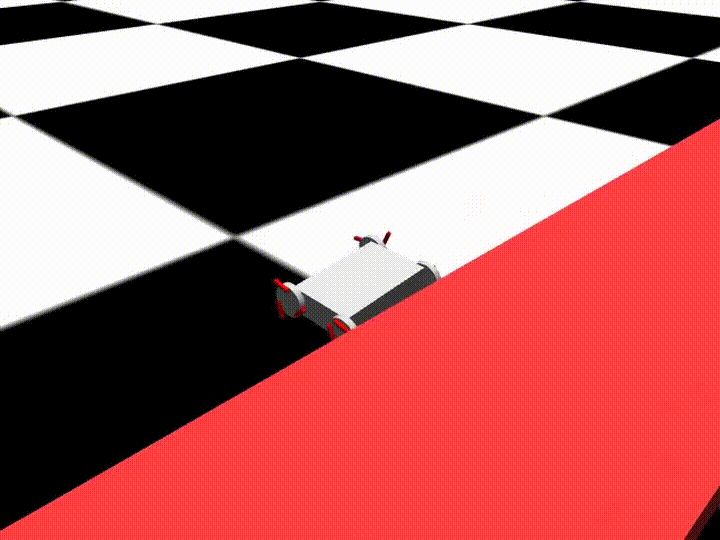

# Transformable Wheel Robot

## Demo



## MuJoCo Playground Training Script

```bash
./.venv/bin/python train_jax_ppo.py --env_name="TransformableWheelMobileRobot"
```

This script is part of [MuJoCo Playground](https://github.com/google-deepmind/mujoco_playground). We should occasionally look for updates to the script. When we update the script we need to add `import twmr` to the top.

## Development Workflow

### Prerequisites

- Your system must have git installed (this is already installed on the HPC).
- You should install [Pixi](https://pixi.sh/latest/).
- Install [gh](https://cli.github.com/) with Pixi: `pixi global install gh`

Although a bit confusing, we'll be using both Pixi and uv. You should think of Pixi as a package manager for any tools we'll need, and uv as the Python-only package/workspace manager. We'll mostly use Pixi to install uv, and then use uv to manage our Python packages.

### Git One-Time Setup

```bash
# This only needs to be done once and you've likely done it already
git config --global user.name "YOUR NAME"
git config --global user.email "YOU@EXAMPLE.COM"

# Authenticate Pixi
gh auth login
```

### Initial Workspace Setup

> [!NOTE]
> You shouldn't have to do any of this if you clone the repository. These are notes for the from-scratch setup process that I used.

<details>

<summary>How to create the initial `uv` workspace.</summary>

These commands only need to be run once to setup the project.

```bash
# Assuming the directory was already created or cloned
pixi init .
pixi add uv

# Create a virtual environment with Python 3.11 and create the twmr package
# This will create a uv workspace and virtual environment
# --bare prevents creation of README.md, src/, .python-version, etc. (good for top level)
pixi run uv init --python 3.11 --bare
pixi run uv init --package packages/twmr

# Install playground dependencies and then playground
# First grab tool.uv.indexs and tool.uv.sources from mujoco_playground pyproject.toml
pixi run uv add "jax[cuda12]"
# --> test: .venv/bin/python -c "import jax; print(jax.default_backend())" --> gpu
pixi run uv add warp-lang
pixi run uv pip install "git+https://github.com/google-deepmind/mujoco_playground.git"
# --> test: .venv/bin/python -c "import mujoco_playground" --> no warnings
# Now manually add additional packages to the pyproject.toml file
```

</details>

### Setup From Clone

This is the process you should use when you clone the repository for the first time on a new machine (i.e., the HPC/OnDemand).

```bash
# 1. Clone the repository
cd to/a/resonable/directory
gh repo clone anthonyjclark/twmr-rl

# 2. Setup the project
cd twmr-rl
pixi run uv sync
source .venv/bin/activate
python -m ipykernel install --name mp --display-name "MuJoCo Playground" --user
```

Now you're ready to go!

### Pull Request Workflow

I recommend creating a branch when you are working on a large change (a new feature, a bug fix, etc).
This keeps your changes isolated from the main branch that we all use until they are well tested and ready to be merged in.

You can use the command line to create a branch, commit your changes, and push the branch to your forked repository. You can also use the VSCode interface if you prefer.

```bash
# 1. Create and switch to a new branch named
git checkout -b feat/SHORT-DESCRIPTIVE-NAME

# 2. Make changes to the code and then (repeat as is useful)
git add FILES_YOU_CHANGED/ADDED
git commit -m "SHORT DESCRIPTIVE MESSAGE"

# 3. Push branch to remote repository
git push -u origin feat/SHORT-DESCRIPTIVE-NAME

# Continue working on the feature branch until ready to merge
# Open a Pull Request (PR) on GitHub targeting main and then send a message to have it reviewed
# https://docs.github.com/en/pull-requests/collaborating-with-pull-requests/proposing-changes-to-your-work-with-pull-requests/creating-a-pull-request
```

### Upgrading a Dependency

We'll occasionally get `Failed to fetch` errors because an older version of a pinned depenency is no longer available (2026-02-04: this happened with our MuJoCo dependency). This is someone hard to debug because some people will still be able to install the dependency from cache.

```bash
# Recreate the dependency error by ignoring cache
pixi run uv --no-cache sync --upgrade-package mujoco

# Upgrade the dependency
pixi run uv sync --upgrade-package mujoco
git add
```
